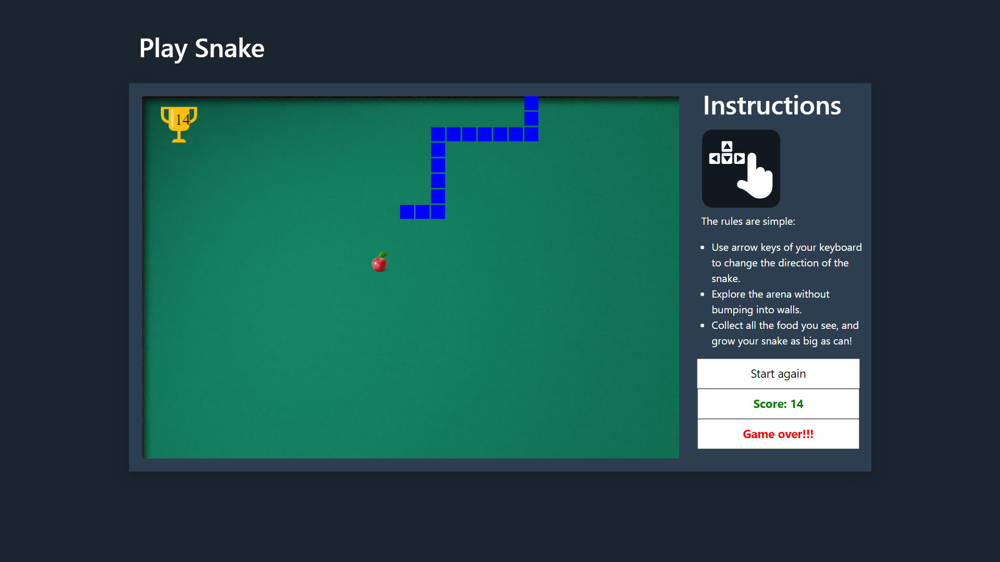

# [Interactive Snake Game](https://yogeshiitm.github.io/snake-game/)
This is an online interactive snake game, designed and coded by [Yogesh Agarwala](http://yogeshiitm.github.io/).\
**View it here: https://yogeshiitm.github.io/snake-game/**

## Game Rules
1. Press "Enter" to start the game.
2. Use arrow keys of your keyboard to change the direction of the snake.
3. Explore the arena without bumping into walls.
4. Collect all the food you see, and grow your snake as big as can!
